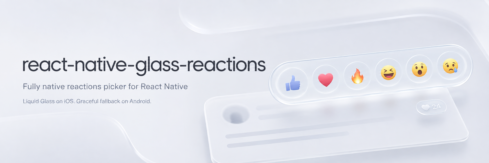

<p align="center">
  <a href="https://www.npmjs.com/package/react-native-glass-reactions"></a>
  <a href="https://www.npmjs.com/package/react-native-glass-reactions"></a>
  <a href="https://github.com/MGasowski/react-native-glass-reactions/actions/workflows/ci.yml"></a>
  <a href="LICENSE"></a>
  <br>
  
  
  
  
</p>

An Instagram-style reactions picker rendered as a **fully native view** — Swift on iOS, Kotlin on Android. The long-press, drag and select interaction and every animation run natively. JavaScript is involved twice per interaction: once at mount, once at selection.

On iOS 26 the picker is drawn with the system **Liquid Glass** material. On older iOS and on Android it degrades to a defined flat surface. It never crashes and never fails a build on an unsupported OS.

<table>
<tr>
<td align="center" width="33%"><b>iOS 26 — Liquid Glass</b></td>
<td align="center" width="33%"><b>iOS — glass off</b></td>
<td align="center" width="33%"><b>Android</b></td>
</tr>
<tr>
<td>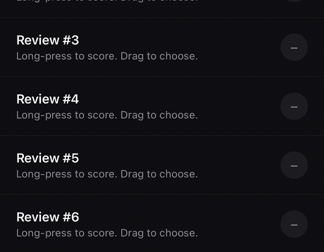</td>
<td>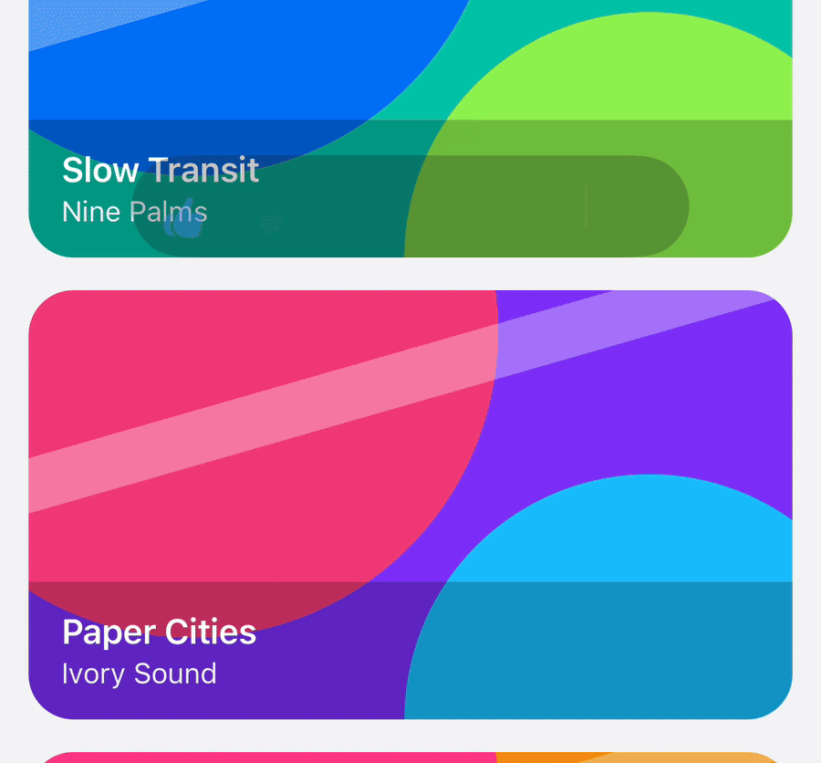</td>
<td>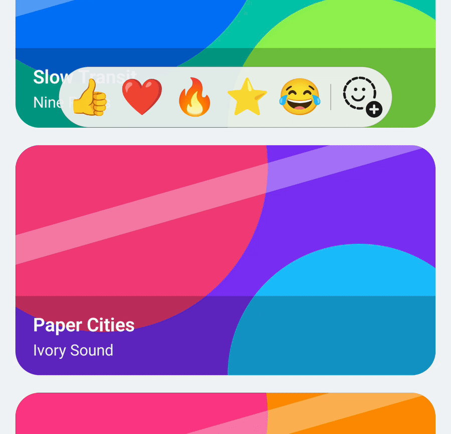</td>
</tr>
<tr>
<td align="center"><sub>Translucent capsule — the row behind it shows through</sub></td>
<td align="center"><sub>Opaque capsule, under Reduce Transparency</sub></td>
<td align="center"><sub>Flat translucent capsule, emoji everywhere</sub></td>
</tr>
</table>

Same gesture and the same JavaScript in all three: long-press, drag across the row, release. Only the capsule material and the reaction rendering differ per platform.

> **Requirements — read before installing.**
> **Xcode 26+** is required to build the iOS side. A consumer on an older Xcode gets a *compile failure*, not a graceful degrade.
> Also required: **React Native 0.80+**, the **New Architecture**, and `react-native-nitro-modules`.
> **Not supported in Expo Go** — you need a development build.

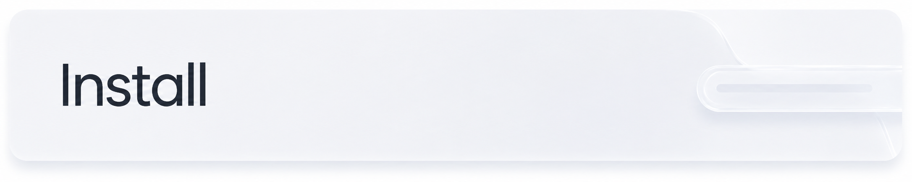

```bash
npm install react-native-glass-reactions react-native-nitro-modules
```

Expo projects must add the config plugin. It is not optional decoration: iOS caps animation at 60 fps on ProMotion iPhones unless `CADisableMinimumFrameDurationOnPhone` is set, which puts the 120 fps target out of reach.

```json
{
  "expo": {
    "plugins": ["react-native-glass-reactions"]
  }
}
```

Bare projects should set that key in `Info.plist` themselves.

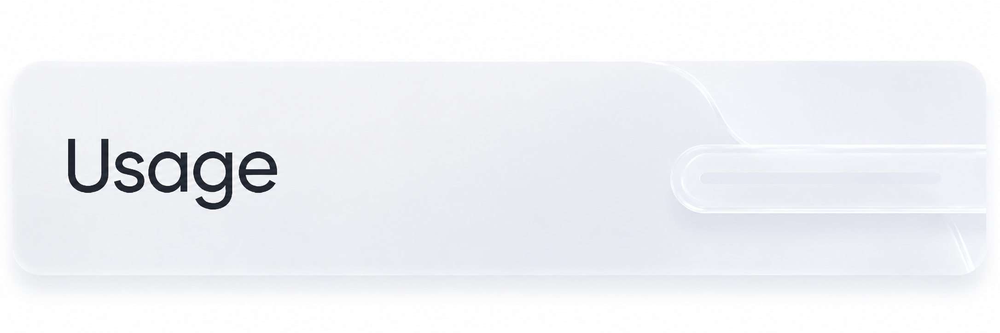

Mount the host once near the root of your app, then wrap anything you want to be long-pressable.

```tsx
import {
  ReactionsPickerHost,
  ReactionTrigger,
  type ReactionItem,
} from 'react-native-glass-reactions';

const REACTIONS: readonly ReactionItem[] = [
  { id: 'like', emoji: '👍', symbol: { ios: 'hand.thumbsup.fill' }, accessibilityLabel: 'Like' },
  { id: 'love', emoji: '❤️', symbol: { ios: 'heart.fill' }, accessibilityLabel: 'Love' },
  { id: 'fire', emoji: '🔥', symbol: { ios: 'flame.fill' }, accessibilityLabel: 'Fire' },
];

function App() {
  const [score, setScore] = useState<string | null>(null);

  return (
    <>
      <ReactionsPickerHost />

      <ReactionTrigger items={REACTIONS} selected={score ?? undefined} onSelect={setScore}>
        <YourRow />
      </ReactionTrigger>
    </>
  );
}
```

`ReactionTrigger` renders no appearance of its own — it wraps your children and nothing else. Showing the selected reaction afterwards is your job, from the `selected` value you already own.

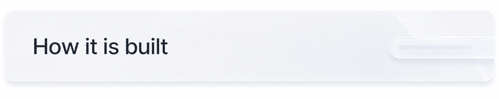

One picker exists at a time, process-wide, and only while a gesture is in flight. It is not mounted per row.

That is the load-bearing decision in the library. A trigger constructs no native view and no gesture recognizer; it registers the tag of the plain `View` it was already rendering. The host owns a single recognizer and resolves the live trigger view at gesture-begin, so no frames are cached in JavaScript and scrolling a long list costs exactly what it costs without the library.

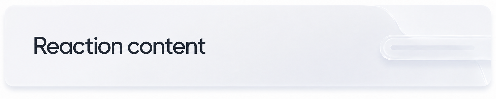

Every item **must** carry an `emoji`. A `symbol` is optional and preferred where it resolves.

Symbols and emoji are not derivable from one another — nothing can produce 🔥 from `flame.fill` — so a fallback only exists if the item carries it. Requiring `emoji` is what makes `renderMode` a safe global kill switch rather than a setting that can blank the picker.

| Platform | Preferred | Falls back to |
| --- | --- | --- |
| iOS | `symbol.ios` (SF Symbol), if it resolves | `emoji` |
| Android | `symbol.android` (Material Symbol), if provided | `emoji` |

SF Symbols are licensed for Apple platforms and cannot ship in an Android artifact, which is why `symbol` is per-platform rather than a single name. Omit `symbol.android` and you get emoji there with no extra work.

Set `renderMode="emoji"` on the host to force emoji everywhere.

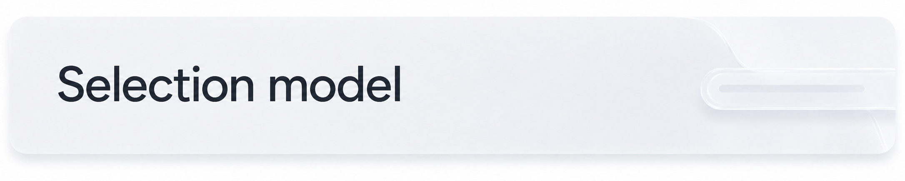

One reaction per user per item — upsert, not additive. Picking a different reaction replaces the current one; picking the reaction that is already selected clears it and emits `null`.

### Another reaction

Give a trigger an `onSelectAnother` handler and the picker grows a trailing **＋** item. Releasing on it opens the **native emoji picker** — the system emoji keyboard on iOS, androidx's `EmojiPickerView` bottom sheet on Android — and the chosen emoji arrives in the handler as a string, not an id:

```tsx
<ReactionTrigger
  items={REACTIONS}
  selected={score ?? undefined}
  onSelect={setScore}
  onSelectAnother={(emoji) => addCustomReaction(emoji)}
  anotherSelected={lastCustomEmoji}
>
```

Pass the picked emoji back as `anotherSelected` and it becomes one extra selectable item in the picker, separated from your reactions by a hairline divider, just before the plus: `[your reactions] | [custom] [+]`. One custom slot exists at most — pass the newest pick to replace it. Selecting it reports through `onSelect` with the emoji string as the id, with the usual upsert-and-deselect semantics.

The plus renders only when there is somewhere for the pick to go — no handler, no plus. It can also be switched off explicitly:

- **Globally:** `<ReactionsPickerHost anotherReactionEnabled={false} />`
- **Per picker:** `<ReactionTrigger anotherReactionEnabled={false} … />` (overrides the global in either direction)

#### Customising the ＋ item

The default glyph is a dashed emoji with a plus badge, and its label is the English `"Add another reaction"`. Both are overridable — globally on the host, or per picker on the trigger:

```tsx
<ReactionsPickerHost
  anotherReactionAppearance={{
    symbol: { ios: 'plus.magnifyingglass' },
    emoji: '➕',
    badge: false,
    accessibilityLabel: t('reactions.addAnother'),
  }}
/>
```

| Field | Default | Notes |
| --- | --- | --- |
| `symbol` | dashed face (`face.dashed`, `circle.dashed` on iOS 15) | iOS only. `symbol.android` is accepted but ignored in 1.x — Android renders emoji only, exactly as it does for items. |
| `emoji` | — | Used when no symbol renders, and forced under `renderMode="emoji"`. The only way to change the Android glyph. |
| `badge` | `true` | The corner plus. Only drawn over a symbol: an emoji already reads as a picked reaction, so badging it reads wrong. |
| `accessibilityLabel` | `"Add another reaction"` | Supply a localized string. |

Every field is optional, and if nothing resolves the built-in glyph draws — the slot never blanks. A trigger's object **replaces** the host's rather than merging into it, so a per-picker override starts from the built-in defaults, not from the global object.

<p align="center">
  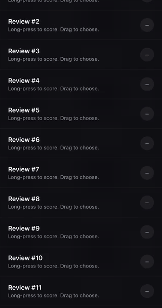
</p>

<p align="center"><sub>Drag to <b>＋</b> → system emoji keyboard → the pick lands on the row and joins the picker, after the divider.</sub></p>

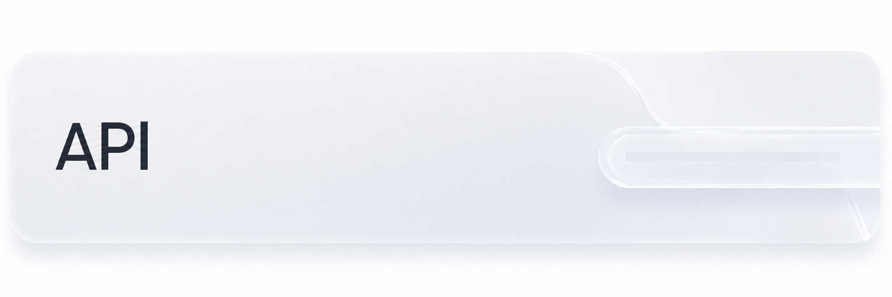

| Export | What it is |
| --- | --- |
| `ReactionsPickerHost` | Required once at the root. Renders nothing. |
| `ReactionTrigger` | Per-item wrapper around your own children. |
| `isLiquidGlassSupported` | Runtime capability flag, backed by the native check. |

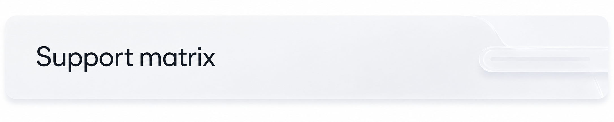

| Library | React Native | Nitro | Min Xcode | Min iOS | Min Android |
| --- | --- | --- | --- | --- | --- |
| 0.1.x | 0.80 – 0.85 | 0.36.x | 26 | 15 (glass on 26+) | API 24 |

The `react-native-nitro-modules` peer range has a pinned floor **and** ceiling. Nitro is pre-1.0 and ships often; expect releases here when it moves.

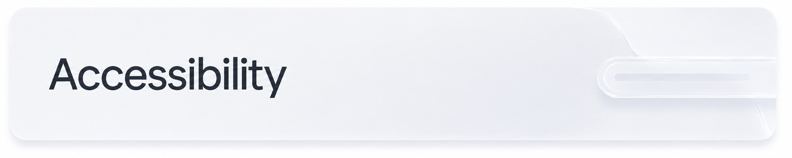

Reactions are exposed as buttons with their `accessibilityLabel`. **Reduce Transparency** replaces glass with an opaque surface, and **Reduce Motion** replaces every spring with a plain fade.

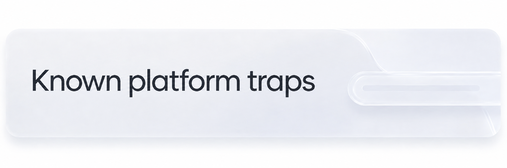

- Never fade the picker with `opacity` from JavaScript. Setting `opacity: 0` on a glass view **or any ancestor** disables the effect outright.
- Glass rendering has regressed across iOS point releases before. Re-verify on each iOS minor.
- Some iOS simulator runtimes cannot render emoji at all — every emoji draws as a missing-glyph box through any API, including plain RN `<Text>`. Observed on iOS 26.3.1, correct on 26.5. Render an emoji through `<Text>` as a control before assuming the library is at fault.

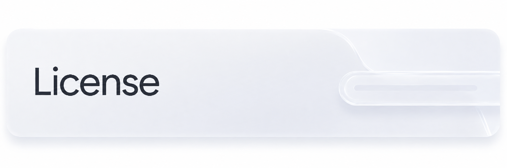

MIT
